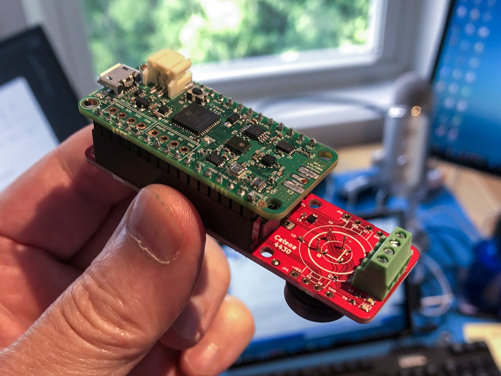

# catena4430-test

This sketch demonstrates the functionality of the MCCI Catena 4430 Feather Wing.

With a Feather-compatible Catena 4710 mounted, the assembly looks like this:

Prior to assembly, the Catena 4430 looks like this:

The Catena 4430 adds the following functions to any compatible Feather-like board.

- Passive Infrared (PIR) motion sensor. This can be mounted on the front or back or the board.

- A battery-backed real-time clock (compatible with Adafruit's [Adalogger FeatherWing](https://www.adafruit.com/product/2922)).

- An SD-card slot similar to the Adalogger, but different in a couple of ways. First the SD-card is electrically buffered going to and from the system; it can't interfere with the SPI bus when you're not usin git. Second, the SD-card slot has a dedicated power supply that is off by default.

- Three additional lights (red, green, and blue).

- A GPIO screw terminal with four posts: two I/O signals, power, and ground. The power at the screw terminal can also be turned on and off under software control.

## Functions performed by this sketch

This sketch has the following features.

- During startup, the sketch queries and displays the RTC value.

- It monitors the PIR sensor and continually computes an "activity fraction", by low-pass filtering the PIR with a time constant of one second. Every two seconds, it outputs that data to the USB console. The RTC is used to time-stamp the data.  Although the data is logged only once every two seconds, a real time estimate is continually updated.

- The sketch dynamically transfers the PIR signal to the blue LED. This gives a real-time indication of the output of the PIR sensor.

- The sketch flashes the Arduino standard LED (D13), the red LED on the 4430, and the green LED on the 4430. It does this in a circular chasing pattern.

- The sketch uses the [Catena Arduino Platform](https://github.com/mcci-catena/Catena-Arduino-Platform.git), and therefore the basic provisioning commands from the platform are always availble while the sketch is running. This also allows user commands to be added if desired.

- Futhermore, the `McciCatena::cPollableObject` paradigm is used to simplify the coordination of the activities described above.

## Key classes

### `cPCA9570` I2C GPIO controller

This class models the hardware of PCA9570 I2C GPIO expander. It has no knowledge of how the PCA9570 is wired up.

### `c4430Gpios` Catena 4430 GPIO Control

This class models the GPIOs of the Catena 4430. It understands the wiring and polarities so that clientscan use method like `c4330Gpios::setBlue()` to turn on the blue LED.

### `cPIRdigital` PIR monitor class

This class monitors the digital output from the PIR and accumulates an activity estimate.

### `cTimer` simple periodic timer class

This class simplifies the coding of periodic events driven from the Aduino `loop()` routine.

